# Test Images

### Test images are in /assets/testImages

##### Test Start Users

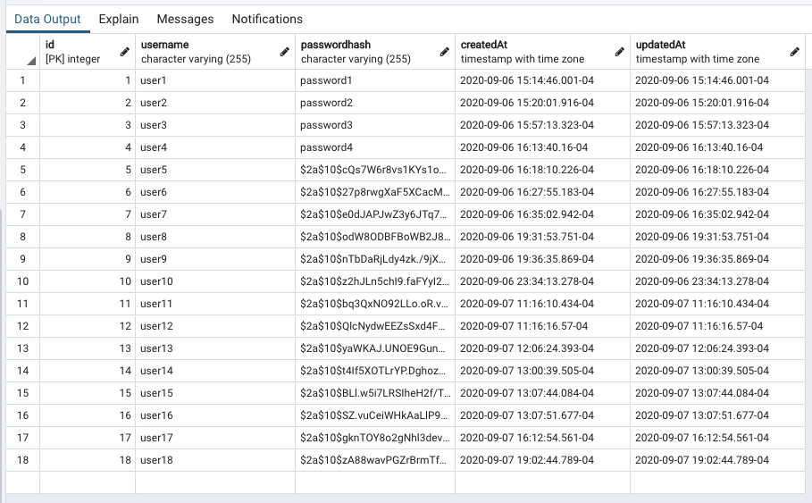

##### Test Start Logs

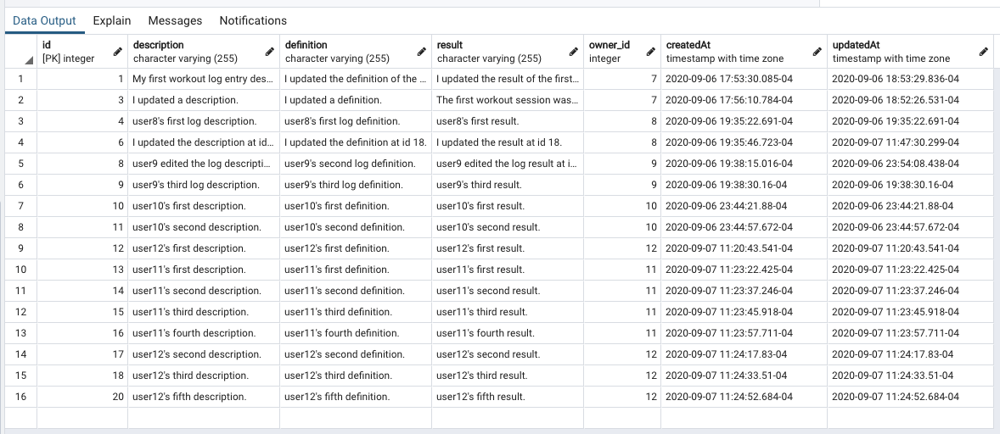

##### user19 Register Success

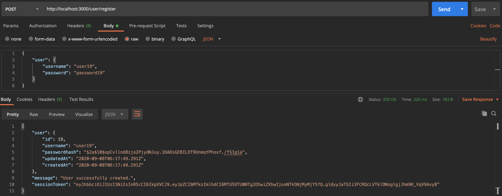

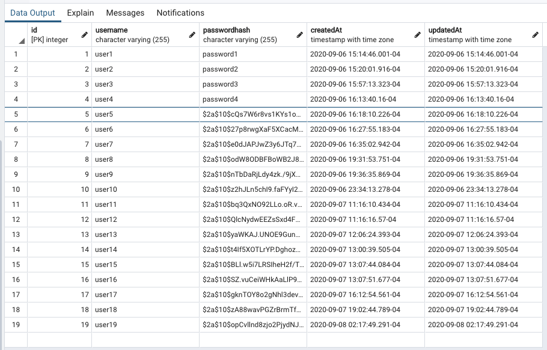

##### user19 Login Success

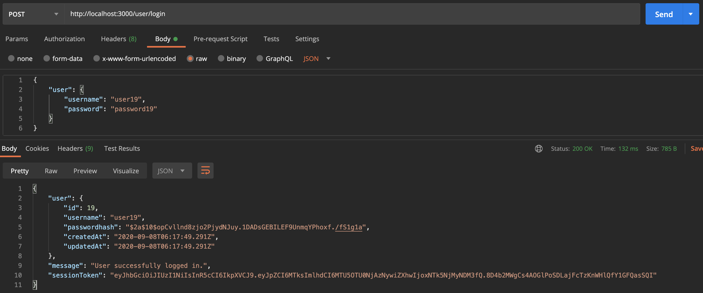

##### user8 Create Log Success

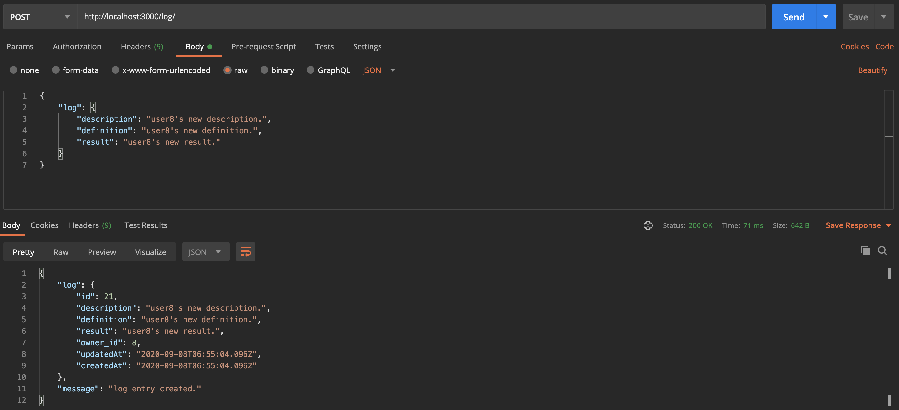

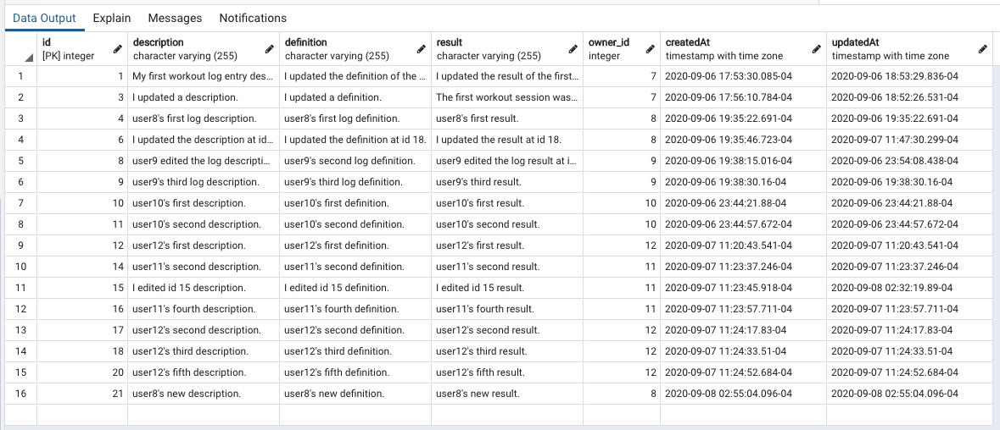

##### User 10 All Logs Success

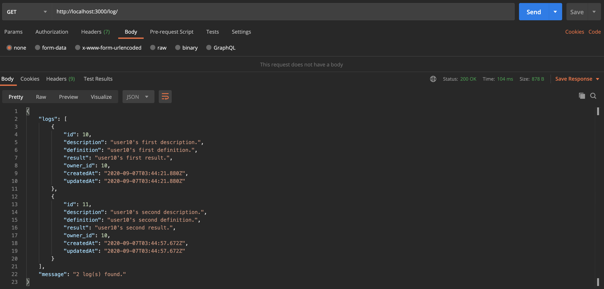

##### User 9 Individual Log 8 Success

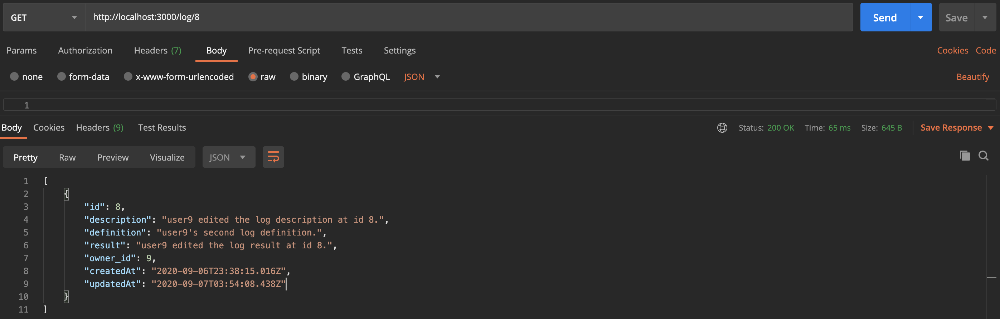

##### User 11 Individual Log 15 Update Success

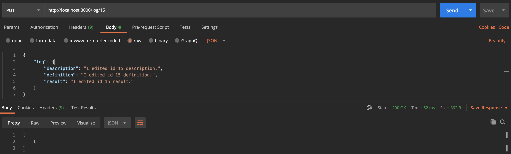

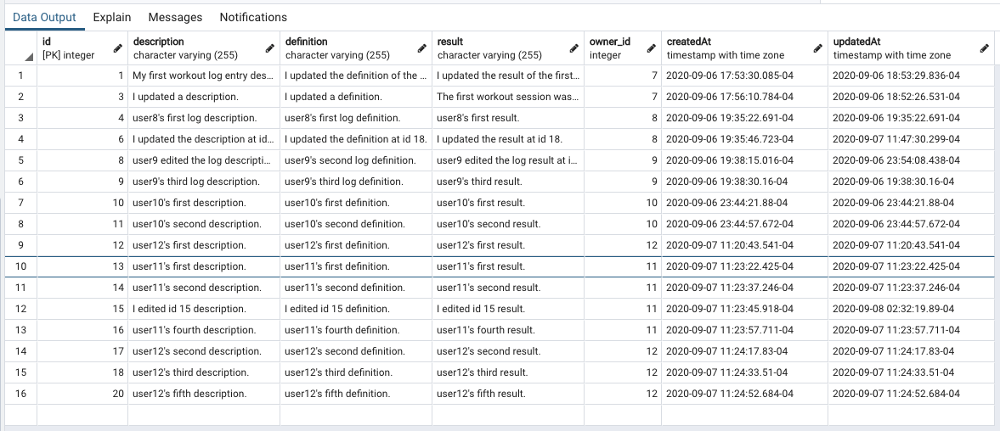

##### User 11 Individual Log 13 Delete Success

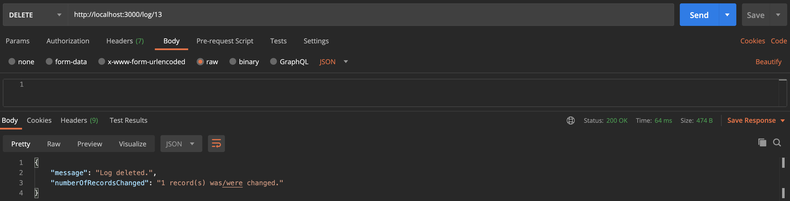

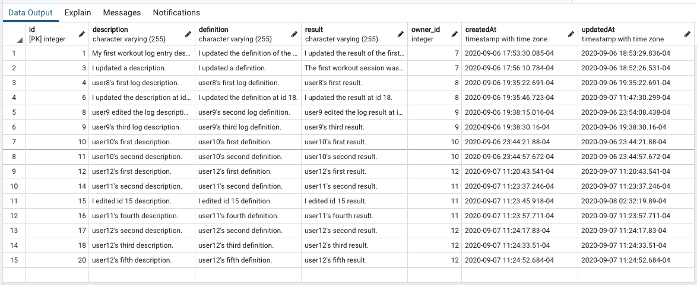
